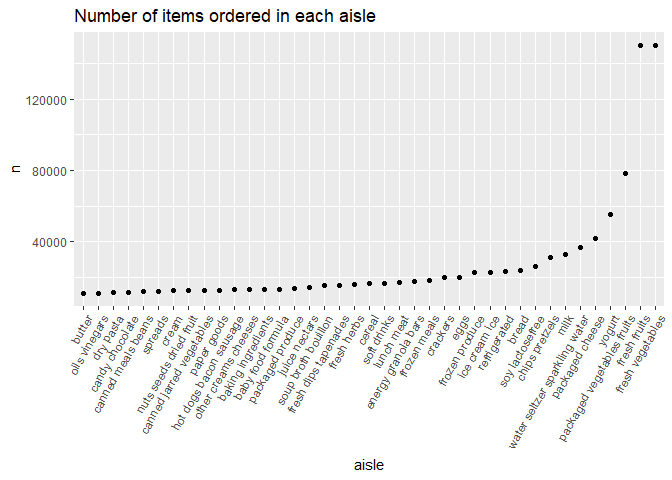

p8105_hw3_bf2506.Rmd
================
2022-10-10

``` r
library(tidyverse)
```

### Problem 2

#### Load, tidy, and wrangle accel_data

``` r
accel_data = 
  read.csv("./data/accel_data.csv") %>% 
  janitor::clean_names() %>% 
  mutate(weekday_vs_weekend = ifelse(day == c("Saturday", "Sunday"), "weekend", "weekday")) %>% 
  select(week, day_id, day, weekday_vs_weekend, everything())
```

**Describe the accel_data** <br> There are 35 observations and 1444
variables. <br> Variables: “week”, “day_id”, “day”,
“weekday_vs_weekend”, “activity\_\*“(from”activity_1” to
“activity_1440”) <br>

#### Traditional analyses of accel_data

``` r
accel_data = 
  mutate(accel_data, total_activity = rowSums(accel_data[5:1444])) %>% 
  select(week, day_id, day, weekday_vs_weekend, total_activity, everything())
```

``` r
total_activity_table =
  select(accel_data, week, day_id, day, weekday_vs_weekend, total_activity) %>% 
  mutate(day = fct_relevel(day, c("Monday", "Tuesday", "Wednesday", "Thursday", "Friday", "Saturday", "Sunday"))) %>% 
  arrange(week, day)

df = 
  select(total_activity_table, total_activity)
```

**Trend** <br> The man is more active from week 1 to week 3, and is less
active from week 4 to week 5. On average, he is more active on Friday.
Considering the two outliers data we found on Saturday in week 4 and
week 5, there may be some mistakes. But there is no obvious
monotonically increasing or decreasing trend.

#### Make a single-panel plot

``` r
plot_df = 
   pivot_longer(
    accel_data,
    activity_1:activity_1440, 
    names_to = "activity_No", 
    values_to = "activity_counts")

hour_activity_plot = 
    ggplot(plot_df, aes(x = activity_No, y = activity_counts, color = day)) + 
  geom_point() + 
  theme(legend.position = "bottom", axis.text.x = element_blank()) + 
  labs(title = " Accelerometer Activity Counts by Day", x = "Time", y = "Activity_Counts")

hour_activity_plot
```

<!-- -->

**Describe the graph** <br> We can conclude that the man is usually
active on the Friday morning and on the Sunday evening, less active on
Wednesday.

### Problem 3

``` r
library(p8105.datasets)
data("ny_noaa")

library(patchwork)
library(ggridges)
```

**Describe ny_noaa** <br> This dataset contains 2595176 observations and
7 variables related to some weather data in New York, which are provided
by NOAA. The Variables are as following: <br> **id**: Weather station ID
<br> **date**: Date of observation <br> **prcp**: Precipitation (tenths
of mm) <br> **snow**: Snowfall (mm) <br> **snwd**: Snow depth (mm) <br>
**tmax**: Maximum temperature (tenths of degrees C) <br> **tmin**:
Minimum temperature (tenths of degrees C) <br> And we can find: <br>
145838 NA in prcp, 381221 NA in snow, 591786 NA in snwd, 1134358 NA in
tmax, 1134420 NA in tmin. Many stations report precipitation only, and
tmax and tmin have the most missing data. The missing data will make a
not comprehensive enough and not accurate enough analysis. For example,
lacking enough data on temperature will prevent us from analyzing the
contrast or trend of maximum and minimum temperatures across New York
from 1981 to 2010.

#### Data cleaning

``` r
ny_noaa_df =  
  ny_noaa %>% 
  janitor::clean_names() %>% 
  separate(date, into = c("year", "month", "day"), convert = TRUE) %>% 
  mutate(tmax = as.numeric(tmax)/10, tmin = as.double(tmin)/10)
```

``` r
ny_noaa_snowfall = 
  ny_noaa_df %>% 
  drop_na(snow)
```

**For snowfall**, 0 is the most commonly observed values. I think it is
because, generally, snow only happens in the winter, with a 25%
percentage in a year, and some places may not get snow.

#### Two-panel plot Average tmax in January and July

``` r
Avetmax_in_Jan_and_Jul = 
  ny_noaa_df %>% 
  select(id, year, month, tmax) %>% 
  filter(month %in% c(1, 7)) %>% 
  group_by(id, month, year) %>%
  summarize(avetmax = round(mean(tmax, na.rm = TRUE), digits = 2))

Avetmax_plot = 
  ggplot(Avetmax_in_Jan_and_Jul, aes(x = year, y = avetmax, color = id, group = id)) + 
  geom_point(alpha = .6) +
  geom_line(alpha = .4) + 
  facet_grid(. ~ month) +
  theme(legend.position = "none") + 
  labs(title = "Average Max Temperature In Jan and Jul In Each Station Across Years", x = "Year", y = "Average Max Temperature / ℃")

Avetmax_plot
```

<!-- -->

**Observation** <br> The maximum temperature in January fluctuates more
than in July and is also reasonably lower than in July. From 1981 to
2010, We could not see a significant upward or downward trend in the
maximum temperature in both Jan and Jul in New York. And there some
outliers in both Jan and Jul plot.

#### Two-panel plot TMAX vs TMIN and snowfall

``` r
tmax_tmin_plot = 
  ggplot(ny_noaa_df, aes(x = tmin, y = tmax)) + geom_hex() + 
  labs(title = "Max Temperature VS Min Temperature", x = "Min Temperatue / ℃" , y = "Max Temperature / ℃")
```

``` r
##to make r run faster, i get a new small table
snowfall_plot_df = 
  ny_noaa_df %>% 
  select(id, year, snow) %>% 
  drop_na(snow) %>% 
  filter(snow > 0 & snow < 100)

snowfall_plot = 
  ggplot(snowfall_plot_df, aes(x = snow, y = year, group = year)) + 
  geom_density_ridges(scale = .85) + 
  labs(title = "Distribution of Snowfall Values from 0 to 100 By Year", x = "Snowfall / mm", y = "Year")
```

``` r
(tmax_tmin_plot + snowfall_plot)
```

<!-- -->

**Describe** <br> **·** There is roughly a positive correlation between
the minimum and maximum temperatures, and when the minimum temperature
is high, the maximum temperature will also be high. <br> **·** The
distribution of snowfall values greater than 0 and less than 100
separately by year are concentrated from 0 to 40. A few values locate
from 40 to 80, and the fewest are above 80.

### Problem 1

``` r
library(p8105.datasets)
data("instacart")
```

#### Read in the data

``` r
data("instacart")

instacart = 
  instacart %>% 
  as_tibble(instacart)
```

#### Answer questions about the data

This dataset contains 1384617 rows and 15 columns, with each row
resprenting a single product from an instacart order. Variables include
identifiers for user, order, and product; the order in which each
product was added to the cart. There are several order-level variables,
describing the day and time of the order, and number of days since prior
order. Then there are several item-specific variables, describing the
product name (e.g. Yogurt, Avocado), department (e.g. dairy and eggs,
produce), and aisle (e.g. yogurt, fresh fruits), and whether the item
has been ordered by this user in the past. In total, there are 39123
products found in 131209 orders from 131209 distinct users.

Below is a table summarizing the number of items ordered from aisle. In
total, there are 134 aisles, with fresh vegetables and fresh fruits
holding the most items ordered by far.

``` r
instacart %>% 
  count(aisle) %>% 
  arrange(desc(n))
```

    ## # A tibble: 134 × 2
    ##    aisle                              n
    ##    <chr>                          <int>
    ##  1 fresh vegetables              150609
    ##  2 fresh fruits                  150473
    ##  3 packaged vegetables fruits     78493
    ##  4 yogurt                         55240
    ##  5 packaged cheese                41699
    ##  6 water seltzer sparkling water  36617
    ##  7 milk                           32644
    ##  8 chips pretzels                 31269
    ##  9 soy lactosefree                26240
    ## 10 bread                          23635
    ## # … with 124 more rows

Next is a plot that shows the number of items ordered in each aisle.
Here, aisles are ordered by ascending number of items.

``` r
instacart %>% 
  count(aisle) %>% 
  filter(n > 10000) %>% 
  mutate(aisle = fct_reorder(aisle, n)) %>% 
  ggplot(aes(x = aisle, y = n)) + 
  geom_point() + 
  labs(title = "Number of items ordered in each aisle") +
  theme(axis.text.x = element_text(angle = 60, hjust = 1))
```

<!-- -->

Our next table shows the three most popular items in aisles
`baking ingredients`, `dog food care`, and `packaged vegetables fruits`,
and includes the number of times each item is ordered in your table.

``` r
instacart %>% 
  filter(aisle %in% c("baking ingredients", "dog food care", "packaged vegetables fruits")) %>%
  group_by(aisle) %>% 
  count(product_name) %>% 
  mutate(rank = min_rank(desc(n))) %>% 
  filter(rank < 4) %>% 
  arrange(desc(n)) %>%
  knitr::kable()
```

| aisle                      | product_name                                  |    n | rank |
|:---------------------------|:----------------------------------------------|-----:|-----:|
| packaged vegetables fruits | Organic Baby Spinach                          | 9784 |    1 |
| packaged vegetables fruits | Organic Raspberries                           | 5546 |    2 |
| packaged vegetables fruits | Organic Blueberries                           | 4966 |    3 |
| baking ingredients         | Light Brown Sugar                             |  499 |    1 |
| baking ingredients         | Pure Baking Soda                              |  387 |    2 |
| baking ingredients         | Cane Sugar                                    |  336 |    3 |
| dog food care              | Snack Sticks Chicken & Rice Recipe Dog Treats |   30 |    1 |
| dog food care              | Organix Chicken & Brown Rice Recipe           |   28 |    2 |
| dog food care              | Small Dog Biscuits                            |   26 |    3 |

Finally is a table showing the mean hour of the day at which Pink Lady
Apples and Coffee Ice Cream are ordered on each day of the week. This
table has been formatted in an untidy manner for human readers. Pink
Lady Apples are generally purchased slightly earlier in the day than
Coffee Ice Cream, with the exception of day 5.

``` r
instacart %>%
  filter(product_name %in% c("Pink Lady Apples", "Coffee Ice Cream")) %>%
  group_by(product_name, order_dow) %>%
  summarize(mean_hour = mean(order_hour_of_day)) %>%
  spread(key = order_dow, value = mean_hour) %>%
  knitr::kable(digits = 2)
```

    ## `summarise()` has grouped output by 'product_name'. You can override using the
    ## `.groups` argument.

| product_name     |     0 |     1 |     2 |     3 |     4 |     5 |     6 |
|:-----------------|------:|------:|------:|------:|------:|------:|------:|
| Coffee Ice Cream | 13.77 | 14.32 | 15.38 | 15.32 | 15.22 | 12.26 | 13.83 |
| Pink Lady Apples | 13.44 | 11.36 | 11.70 | 14.25 | 11.55 | 12.78 | 11.94 |
